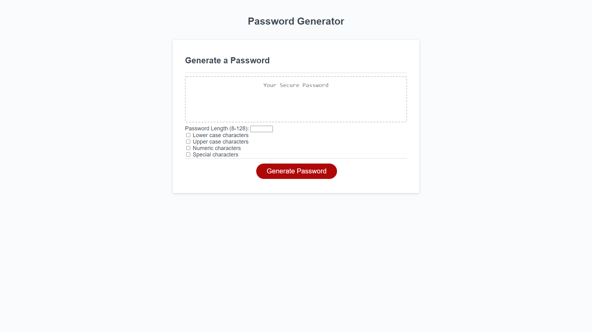
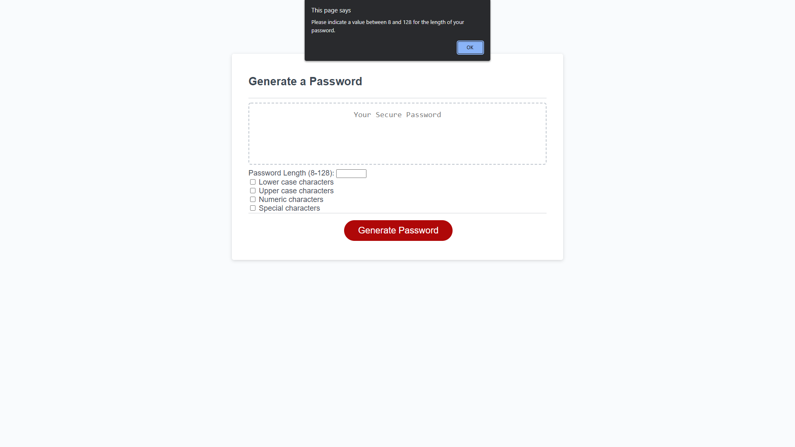
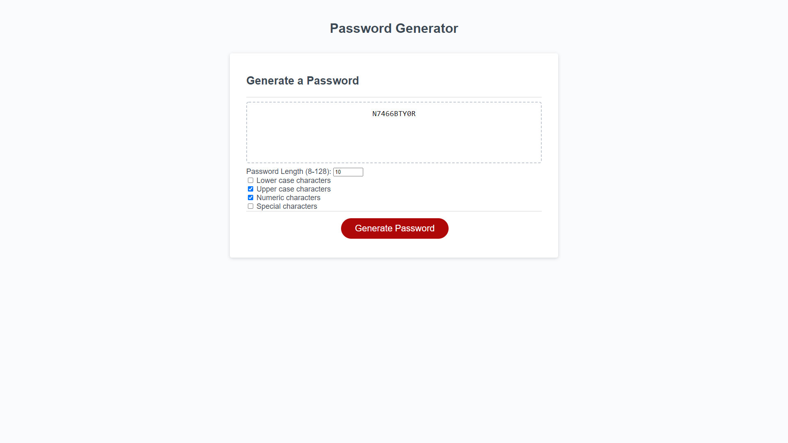

# Password Generator
> By Richard Zhang

## Description

- I am very new to JavaScript, so my motivation behind this project was to learn how the provided JavaScript was interacting with the HTML document. I was also interested in piecing together the logic needed to generate a password based on user input.
- There are a lot of new concepts, functions (both built-in and developer made) that I cannot identify yet. So I built this project to better understand the language, and to better my logic. 
- This password generator is my first attempt at creating something that has actual function. It can actually be used for something useful: namely creating passwords. It also hints at how suggested passwords are created for users on other websites, and so provides a bit of insight at how powerful JavaScript can be.
- Through working on this project, I learned how to dissect JavaScript code and how to interpret what the provided code was designed to do. Logging to the console some of the code provided a lot of insight into these things, such as what a specific line of code might be returning to be stored in a variable. I also got to practice some debugging, and the general logic of if statements, and loops. 
- My project is pretty basic. I think my code reflects a crude way of satisfying the challenge criteria. I have a lot of code that does very similar things to respond to slightly different inputs. I tried to follow DRY practice as much as possible, but could've probably coded more efficiently. I will do my best going forward to try to code more efficiently, and will return to this project at a later time to clean up the code. 

##  Link and Screenshots

> [Link to the live webpage](https://richardzhang01.github.io/password-generator/)

